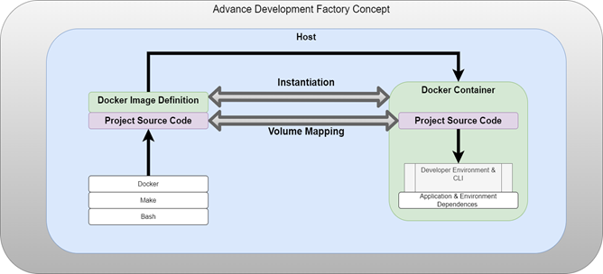

# Advance Development Factory

## Summary
---

As part of a diverse ecosystem of applications and technologies within software development, a need has been identified that standardizes the building, testing, and deployment of an organization's application suite. This repo Advance Development Factory sets the standard for developers  to build, test, and deployment of a diverse set of applications under a common framework that mitigates clients operating environment dependencies.

The ADF provides all UMGC projects with a standard mechanism for building, testing and deploying applications whilst limiting users operating environment dependencies. ADF is able to accomplish a low operating environment dependency by building the environment in which users can build, test, and deploy applications.  ADF is a bootstrap application context that leverages Docker to isolate user's environments.

## Capablities
---

The core features of the ADF provides are:

* An isolated operating environment
* A mechanism for building applications
* A Mechanism for testing applications
* A Mechanism for deploying applications

#### How to use
---

When ADF runs in the Azure pipline it pushed a docker image to docker.io. When a development project runs `make all`, the ADF build image will get pulled down and used as the container for the development project.

The ADF could be thought of as three separate working components:

* Dockerfile
  * Configures the container including all the dependencies required by other students.
  * If development teams have a dependency not covered by ADF, that dependency could be installed here using yum.
* Make
  * We use make to define recipies for every step in the build process.
* azure-pipelines.yml
  * Used by azure. Defines the pipleline which runs our make recipies.
  * The ADF only needs three steps:
    * make build-env
    * Log into docker.io
    * make push

Important Note:
	If you get acquainted with ADF now, once you start integrating the development teams projects with ADF you will notice that each of their projects also has the three mentioned above. The files are even in the same directory. This is because ADF could be thought of as a parent of the Development projects once configured properly. All Development projects shall conform to the structure of ADF with regards to where the azure, docker, and makefile are located. 

#### How to use
---
** TBD **

